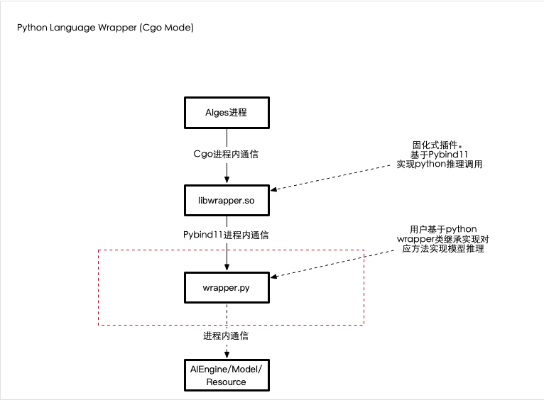
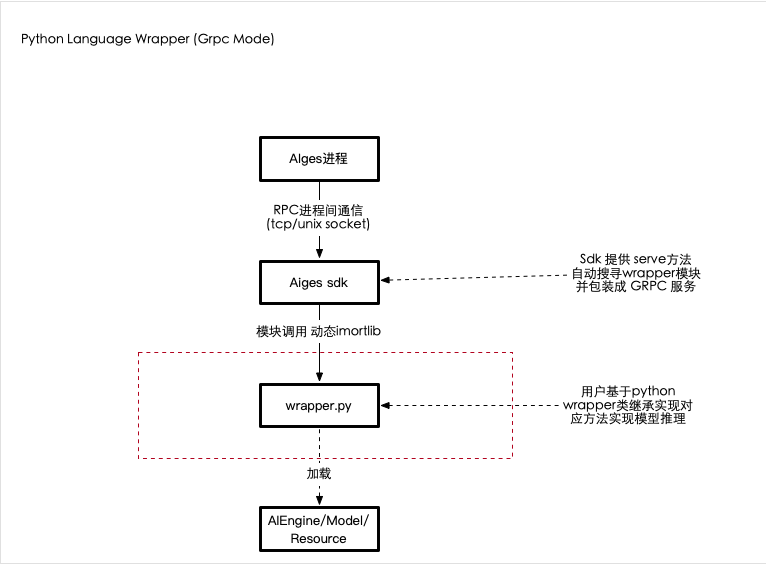

<!-- # V2-New Design of wrapper.py设计(进行中) -->

## :star:Python加载器插件文档 

*** 上新!!!新增 GRPC模式，区别于之前的CGO调用Wrapper方式*** 


Python Language Wrapper CGo模式:



Python Language Wrapper GRPC模式:



[👉👉👉快速查看](Grpc_wrapper/Python安装sdk)


## 背景

1. 之前的wrapper.py 由[C项目](https://github.com/xfyun/aiges_c_python_wrapper)
   实现了 [wrapper接口](https://github.com/xfyun/aiges_c_python_wrapper/blob/master/include/aiges/wrapper.h)实现。

   CGO 模式下:  **aiges_c_python_wrapper**编译成`libwrapper.so`，由aiges统一加载。
   Grpc 模式下: aiges 和 python wrapper.py之间使用grpc通信
   
2. 之前如果python用户需要实现推理插件， 只需要参考 [wrapper.py](https://github.com/xfyun/aiges/blob/master/demo/mmocr/wrapper.py)实现对应接口后，即可实现python推理。

3. 当用户实现`wrapper.py`后， 无法直接调试运行，且不太了解`aiges`如何调用`wrapper.py`以及传递到 `wrapper.py`对应的参数是什么类型都非常疑惑，造成python版本的AI推理插件集成方式并不那么pythonic。

## 新版wrapper.py集成方式优化目标

1. 用户可以定义AI能力输入的数据字段，控制字段列表。

2. 用户可以按需定义AI能力输出的字段列表。

3. 平台工具可以通过`wrapper.py`自动导出用户schema并配置到webgate，对用户屏蔽schema概念。

4. 平台工具可以提供用户直接运行`wrapper.py`，并按照平台真实加载`wrapper.py`方式传递对应参数，方便用户在任何环境快速Debug，发现一些基础问题。

5. 尽可能简化用户输入，并且在有限的用户输入下，获取平台需要的信息。

6. 尽可能提升python能力的推理效率和性能。

## wrapper.py 新设计


1. 提供 python sdk:  python sdk将发布到 pypi，方便用户随时安装和更新。

2. [为什么?](#为什么) 新wrapper要求用户 实现 `Wrapper` 类，并将原有 函数式 wrapper开头的函数放入到 `Wrapper` （类方法|对象方法？待讨论 todo)中去。用户实现的`Wrapper`类必须**继承**`WrapperBase`类，并且`wrapperInit`、`wrapperFini`、`wrapperOnceExec`和`wrapperError`等函数在`WrapperBase`类被声明为类方法`@classmethod`，未实现则会抛出`NotImplementedError`错误。

3. 用户在Wrapper类中除了要实现原有的`wrapperInit`、`WrapperExec`等实现之外，需要额外定义能力的输入和输出，最终生成的HTTP接口基于此信息生成。

4. 将用户的请求响应对象转为实现Buffer protocol的对象，然后使用memoryview建立视图来减少内存数据的copy,增加wrapper.py的推理效率。


### 为什么

   - 我们希望用户只需要定义关键的实现，而不必关心背后`wrapper.py`如何被调用的细节，这块背后逻辑其实是复杂的，我们不希望在`wrapper.py`中让用户过多的定义一些平台预先要求的设定，我们希望在SDK的基类中实现定义好这些默认行为，比如`wrapper.py`真实调用顺序 为 `WrapperInit` -> `WrapperExec` -> `WrapperFin`。

   - 基类中定义行为的好处是，用户继承基类并实现必要方法后，可以直接运行，并且调试拿到结果。

   - 至于为什么希望用户通过继承`WrapperBase`类来实现 Wrapper类中，是因为可以在基类行为中做一些更Pythonic的魔法，从而简化用户的输入。

      [新版本Python加载器插件](https://github.com/xfyun/aiges_c_python_wrapper/blob/master/wrapper.py)


### WrapperBase类
新版Python加载器插件最大的改变是引入了`WrapperBase`类，用户实现的`Wrapper`类必须**继承**`WrapperBase`类，并且`wrapperInit`、`wrapperFini`、`wrapperOnceExec`和`wrapperError`等函数在`WrapperBase`类被声明为类方法`@classmethod`，未实现则会抛出`NotImplementedError`错误

### 快速开始你的第一个wrapper.py

**下面介绍一个调用三方API的Python加载器插件的实现过程来帮助您理解整个过程。**

#### 准备项目

   1. [安装或者更新](#appendix)aiges sdk库 (该sdk用于辅助`wrapper.py`本地调试)

   2. 使用 aiges 快速生成你的python项目
      ```python
      python -m aiges create -n  "project"
      ```
      该命令生成一个 "project" 文件夹，并包含 wrapper.py 的半成品。

   3. 添加项目内依赖，[完善wrapper.py并且本地调试通过](#完成本地调试)。

   4. 将wrapper.py 构建为docker镜像，并发布到 athena_serving框架。

   5. 访问你的AI HTTP API... Enjoy...

#### 完成本地调试

##### :exclamation: 提前注意
   - 实现`Wrapper`类时，必须**继承**`WrapperBase`类。
   - 运行中用到的参数，可以选择将变量声明为类变量，实例变量同样可选。为了模拟AIservice传递参数，在`Wrapper`类中声明一个类成员config用于初始化，上线后**选择注释**即可，在本例中如下
      ```python
      class Wrapper(WrapperBase):
         requrl, http_method, http_uri = None, None, None
         # music
         access_key_music, access_secret_music = None, None
         # humming
         access_key_humming, access_secret_humming = None, None

         config = {}
         config = {
         "requrl" : ...,
         "http_method" : ...,
         "http_uri" : ...,
         "access_key_music" : ...,
         "access_secret_music" : ...,
         "access_key_humming" : ...,
         "access_secret_humming" : ...
         }
      ```
   - `wrapperOnceExec`函数执行返回的类型是`Response`对象，而不是通常表示执行状态错误码的`int`类型，意味着**无论结果正常与否**，均需实例化`Response`对象并返回。
      ```python
      res = Response()
      ```
      - 未出现异常时，`Response`对象是是由一个或多个`ResponseData`对象构成的列表，其中`ResponseData`类有`key`、`data`、`len`、`type`和`status`五个成员变量
         ```python
         l = ResponseData()
         l.key = "output_text"
         l.status = 3
         l.len = len(r.text.encode())
         l.data = r.text
         l.type = 0
         res.list = [l]
         # multi data: res.list = [l1, l2, l3]
         return res
         ```
      - 出现异常时，直接调用`Response`对象的`response_err`方法返回错误码
         ```python
         return res.response_err(ERROR_CODE)
         ```

##### 继承`WrapperBase`类完成`Wrapper`类的构建

   1. `wrapperInit`用于初始化加载器执行过程中用到的变量，参数从字典变量`config`中读入
      ```python
      def wrapperInit(cls, config: {}) -> int:
         print("Initializing ..")
         config = config

         Wrapper.requrl, Wrapper.http_method, Wrapper.http_uri = config['requrl'], config['http_method'], config['http_uri']
         Wrapper.access_key_music, Wrapper.access_secret_music = config['access_key_music'], config['access_secret_music']
         Wrapper.access_key_humming, Wrapper.access_secret_humming = config['access_key_humming'], config['access_secret_humming']

         print('----------Finish Init--------------')
         
         return 0
      ```

   2. `wrapperError`将会返回错误码代表的含义，在本例中如下
   ```python
   def wrapperError(cls, ret: int) -> str:
      if ret == 1001:
         return "识别无结果"
      elif ret == 2000:
         return "录音失败，可能是设备权限问题"
      elif ret == 2001:
         return "初始化错误或者初始化超时"
      elif ret == 2002:
         return "处理metadata错误"
      elif ret == 2004:
         return "无法生成指纹（有可能是静音）"
      elif ret == 2005:
         return "超时"
      elif ret == 3000:
         return "服务端错误"
      elif ret == 3001:
         return "Access Key不存在或错误"
      elif ret == 3002:
         return "HTTP内容非法"
      elif ret == 3003:
         return "请求数超出限制（需要升级账号）"
      elif ret == 3006:
         return "参数非法"
      elif ret == 3014:
         return "签名非法"
      elif ret == 3015:
         return "QPS超出限制（需要升级账号）"
      else:
         return f"User Defined Error: {ret}"
   ```

   3. `wrapperFini`用于处理一些加载器插件的堆区指针的回收工作，对于Python语言，通常不需要实现：
   ```python
   def wrapperFini() -> int:
      logging.info('Wrapper finished.')
      return 0
   ```

   4. `wrapperOnceExec`的执行由<u>鉴权</u>、<u>发送HTTP请求</u>和<u>接收响应数据</u>构成
      ```python
      def wrapperOnceExec(self, params: {}, reqData: DataListCls) -> Response:
         ......
         # 鉴权
         data_mode = params['mode']
        
         access_key = Wrapper.access_key_music if data_mode == 'music' else Wrapper.access_key_humming
         access_secret = Wrapper.access_secret_music if data_mode == 'music' else Wrapper.access_secret_humming
       
         src = reqData.list[0].data# binary files
         sample_bytes = reqData.list[0].len
         signature_version, data_type = '1', 'audio'
            
         timestamp = time.time()
         res = Response()
        
         string_to_sign = Wrapper.http_method + '\n' \
                     + Wrapper.http_uri + '\n' \
                     + access_key + '\n' \
                     + data_type + '\n' \
                     + signature_version + '\n' \
                     + str(timestamp)
         sign = base64.b64encode(hmac.new(access_secret.encode('ascii'), string_to_sign.encode('ascii'),digestmod=hashlib.sha1).digest()).decode('ascii')
        
         if sign is None:
               return res.response_err(5014)

         # 发送http请求
         files = {'sample': src}
         data = {
               'access_key': access_key,
               'sample_bytes': sample_bytes,
               'timestamp': str(timestamp),
               'signature': sign,
               'data_type': data_type,
               'signature_version': signature_version
         }

         try:
            r = requests.post(Wrapper.requrl, files=files, data=data, timeout=5)
         except requests.exceptions.ConnectTimeout:
            return res.response_err(4408)
         if r is None:
            return res.response_err(4003)

         if r.status_code != 200:
            return res.response_err(4000 + r.status_code)

         # 接受响应数据
         pattern = re.compile('"code":\d+')
         error_code = re.findall(pattern, r.text)
         error_code = error_code[0].split(':')[-1]
        
         if int(error_code):
            return self.response_err(int(error_code))
         else:
            r.encoding = 'utf-8'
            l = ResponseData()
        
            l.key = "output_text"
            l.type = 0
            l.status = 3
            l.data = r.text
            l.len = len(r.text.encode())
            res.list = [l]
        return res 
      ```


#### 本地调试模拟传入数据:heavy_check_mark:
   - 额外声明**用户请求**和**用户响应**两个类

      ```python
      class UserRequest(object):
         '''
         定义请求类:
         params:  params 开头的属性代表最终HTTP协议中的功能参数parameters部分， 对应的是xtest.toml中的parameter字段
                  params Field支持 StringParamField，
                  NumberParamField，BooleanParamField,IntegerParamField，每个字段均支持枚举
                  params 属性多用于协议中的控制字段，请求body字段不属于params范畴

         input:    input字段多用与请求数据段，即body部分，当前支持 ImageBodyField、 StringBodyField和AudioBodyField
         '''
         params1 = StringParamField(key="mode", enums=["music", "humming"], value='humming')

         input1 = AudioBodyField(key="data", path="/home/wrapper/test.wav")
         
      class UserResponse(object):
         '''
         定义响应类:
         accepts:  accepts代表响应中包含哪些字段, 以及数据类型

         input:    input字段多用与请求数据段，即body部分，当前支持 ImageBodyField, StringBodyField, 和AudioBodyField
         '''
         accept1 = StringBodyField(key="ouput_text")
      ```
   - 实例化用户请求和用户响应对象
      ```python
      class Wrapper(WrapperBase):
         # 实例化用户请求类和用户响应类
         requestCls = UserRequest()
         responseCls = UserResponse()
         ......
      ```
   - 声明`main`函数，实例化`Wrapper`对象，运行程序
      ```python
      if __name__ == '__main__':
         m = Wrapper()
         m.schema()
         m.run()
      ```

### Appendix
-  安装和更新

   使用`pip`指令完成`aiges`库的安装和更新
   ```python
   # 安装aiges
   pip install aiges -i https://pypi.python.org/simple
   # 更新aiges
   pip install --upgrade aiges -i https://pypi.python.org/simple
   ```

- 在执行的过程中，错误需要**尽可能早**捕获，错误码也要和第三方平台区别开来，即使是默认的HTTP错误码也要有辨别也好，方便定位错误。

- 调用三方API的Python加载器插件[完整实现可以参考](https://github.com/xfyun/aiges/tree/master/demo/music_api_v2)


